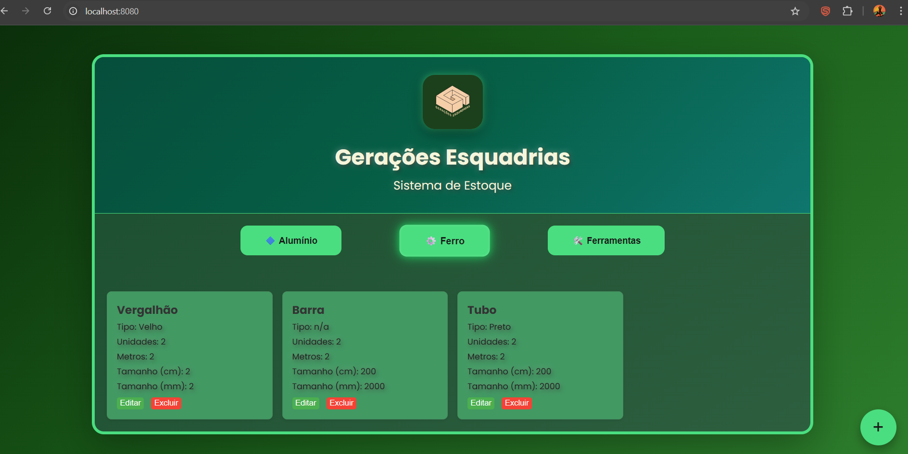
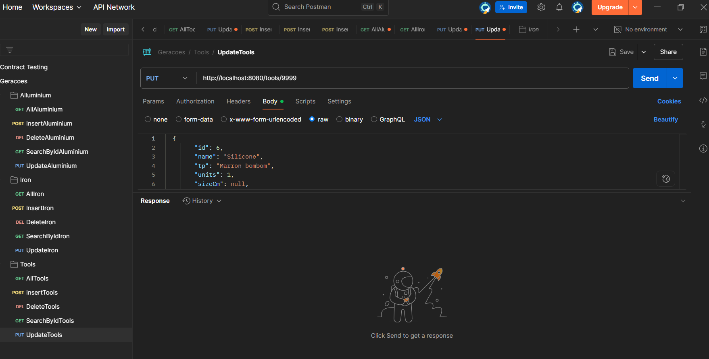

# 🛠️ Sistema de Gestão de Materiais para Serralherias

[](https://www.linkedin.com/in/henriqvedev/)

## 📖 Sobre o Projeto

O OrganizeApp é uma solução para otimizar o controle de estoque de materiais em serralherias. Este sistema visa resolver o problema comum da perda e desorganização de sobras de materiais (como barras, perfis e chapas), que frequentemente resultam em desperdício de recursos e tempo.


## ✨ Funcionalidades Principais

* **Gestão Completa de Itens de Estoque (CRUD):** O sistema permite a criação, leitura (visualização), atualização e exclusão de diferentes tipos de materiais de estoque, incluindo Alumínio, Ferro e Ferramentas. Cada item pode conter informações detalhadas como tipo, unidades, e medidas (metros, centímetros, milímetros).
* **Organização Intuitiva por Categorias:** A interface do usuário é estruturada com "abas" claras e intuitivas, permitindo categorizar e visualizar o estoque por tipo de material (Alumínio, Ferro, Ferramentas). Essa organização facilita a navegação rápida e o controle eficaz do inventário.
* **Visualização Clara e Detalhada do Inventário:** Uma interface de usuário limpa e responsiva exibe os itens de estoque em formato de "cards", apresentando de forma concisa as informações essenciais de cada material. Botões de "Editar" e "Excluir" estão convenientemente disponíveis em cada card de item para manipulação direta.

### Demonstração da Interface (Aba "Ferro" em destaque)

A imagem abaixo ilustra a interface principal da aplicação, mostrando a listagem de itens na aba "Ferro" com seus detalhes e opções de gerenciamento:



## 🚀 Tecnologias Utilizadas

**Backend:**
* **Java 17:** Linguagem de programação principal da aplicação.
* **Spring Boot:** Framework para o desenvolvimento rápido e eficiente das APIs RESTful, e também responsável por servir o conteúdo estático do frontend.
* **Maven:** Ferramenta de automação de build e gerenciamento de dependências do projeto Java.
* **APIs RESTful (CRUD):** Implementação de endpoints completos para a manipulação (Criação, Leitura, Atualização, Exclusão) de dados para cada categoria de material (Alumínio, Ferro, Ferramentas).
* **H2 Database:** Banco de dados em memória, utilizado para prototipagem e testes iniciais durante o desenvolvimento.
* **PostgreSQL (em contêiner Docker):** Banco de dados relacional persistente e robusto, configurado para o ambiente de desenvolvimento local via Docker.
* **Lombok:** Biblioteca auxiliar utilizada para reduzir o código boilerplate em classes Java (ex: geração automática de getters, setters e construtores).

**Frontend:**
* **HTML5:** Utilizado para estruturar o conteúdo e a base da interface da aplicação web.
* **CSS3:** Responsável pela estilização e design moderno da aplicação, garantindo uma experiência de usuário agradável e responsiva.
* **JavaScript:** Implementa a lógica interativa do lado do cliente para a manipulação da interface e a comunicação assíncrona com as APIs do backend.

**Ferramentas:**
* **Docker:** Ferramenta essencial para a containerização da aplicação (Spring Boot) e do banco de dados (PostgreSQL). Garante um ambiente de desenvolvimento e execução consistente, isolado e facilmente replicável.
* **Postman:** Ferramenta amplamente utilizada para testar e validar os endpoints da API RESTful durante todas as fases do desenvolvimento.
* **DBeaver:** Cliente SQL universal utilizado para o gerenciamento, visualização e interação com o banco de dados PostgreSQL.

### Exemplo de Requisições da API (Postman)

A imagem a seguir demonstra a organização das coleções de requisições CRUD no Postman, exemplificando os endpoints para diferentes categorias de materiais:



## ⚙️ Como Rodar o Projeto

### Estrutura do Projeto
O projeto está organizado na pasta raiz `organize`.
* O código-fonte do backend (Spring Boot), incluindo o `pom.xml`, está localizado na raiz da pasta `organize`.
* Os arquivos estáticos do frontend (HTML, CSS, JavaScript) estão em `src/main/resources/static`, sendo servidos diretamente pelo Spring Boot.
* Os arquivos de configuração Docker (`docker-compose.yml` e `Dockerfile` para a aplicação Java) também se encontram na raiz da pasta `organize`, ao lado do `pom.xml`.

### Pré-requisitos

Para executar o projeto, você precisará ter o seguinte software instalado em seu sistema:

* **Java Development Kit (JDK) 17:** Essencial para compilar e, opcionalmente, executar a aplicação Spring Boot diretamente (fora do ambiente Docker).
* **Docker Desktop:** Instale e garanta que o Docker Desktop esteja em execução para que o ambiente containerizado da aplicação e do banco de dados possa ser inicializado.

### Passos para Executar

Siga os passos abaixo para colocar a aplicação em funcionamento:

1.  **Clone o Repositório:**
    Abra seu terminal ou prompt de comando e execute:
    ```bash
    git clone [https://github.com/henriqvedev/Geracoes.git](https://github.com/henriqvedev/Geracoes.git)
    cd organize # Navegue até a pasta raiz do projeto clonado
    ```
2.  **Inicie os Contêineres Docker:**
    No mesmo terminal, a partir da pasta `organize`, execute o comando:
    ```bash
    docker compose up -d --build
    ```
    * Este comando realizará as seguintes ações:
        * Construirá a imagem Docker da sua aplicação Java (`organize-app`) a partir do `Dockerfile`.
        * Baixará a imagem oficial do PostgreSQL (se ainda não estiver presente em seu sistema).
        * Criará e iniciará os dois contêineres: `organize-app-1` (executando a aplicação Spring Boot) e `organize-db-1` (executando o banco de dados PostgreSQL).
        * O contêiner `organize-app-1` expõe a aplicação na porta 8080 (interna e mapeada para a porta 8080 do seu host).
        * O contêiner `organize-db-1` expõe o banco de dados na porta 5432 (interna e mapeada para a porta 5432 do seu host).
        * Ambos os contêineres rodarão em segundo plano (`-d`).

3.  **Verifique o Status dos Contêineres (Opcional):**
    Para confirmar que ambos os contêineres estão rodando corretamente, execute:
    ```bash
    docker ps
    ```
    Você deverá ver `organize-app-1` e `organize-db-1` listados com o status "Up".

4.  **Acesse a Aplicação:**
    Após os contêineres estarem em execução, abra seu navegador de internet e acesse o endereço:
    `http://localhost:8080`
    A interface do usuário do OrganizeApp deverá ser carregada e pronta para uso.

### Acesso ao Banco de Dados (Opcional, via DBeaver ou outro cliente SQL)

Para conectar-se ao banco de dados PostgreSQL que está rodando no Docker a partir de uma ferramenta externa como o DBeaver, utilize as seguintes configurações:

* **Host:** `localhost` ou `127.0.0.1`
* **Porta:** `5432`
* **Banco de Dados:** `postgres`
* **Usuário:** `user`
* **Senha:** `password`
  *(Estas credenciais correspondem às configurações padrão definidas no seu `application.properties` para o ambiente local.)*

## 🚀 Próximos Passos e Melhorias Futuras

Este projeto é um MVP (Minimum Viable Product) com grande potencial para futuras implementações e melhorias. Algumas ideias para o desenvolvimento contínuo incluem:

* **Aplicativo Móvel/Web para Campo:** Expandir a ferramenta para permitir que serralheiros em obras ou em campo consultem o estoque e solicitem materiais diretamente, otimizando a logística de aquisição e movimentação.
* **Sistema de Autenticação e Autorização:** Implementar um módulo completo de login de usuários e controle de acesso baseado em papéis (ex: administrador, estoquista), aprimorando a segurança e o gerenciamento de permissões.
* **Geração de Relatórios:** Desenvolver funcionalidades para gerar relatórios detalhados sobre o consumo de materiais, status de estoque (mínimo/máximo) e histórico de movimentações.
* **Otimização de Buscas e Filtros:** Aprimorar o sistema de busca e adicionar opções de filtros avançados para uma localização ainda mais rápida e eficiente de materiais no inventário.
* **Notificações de Estoque Baixo:** Implementar um sistema de alerta para notificar os responsáveis quando determinados itens atingirem um nível de estoque crítico ou predefinido.

## 🤝 Contribuição

Contribuições são muito bem-vindas! Se você encontrar bugs, tiver sugestões de melhoria ou quiser adicionar novas funcionalidades, sinta-se à vontade para abrir issues ou enviar pull requests.

## 📞 Contato

* **Henrique Barcelos**
* **LinkedIn:** [https://www.linkedin.com/in/henriqvedev/](https://www.linkedin.com/in/henriqvedev/)

## 📄 Licença

Este projeto está licenciado sob a Licença MIT. Para mais detalhes, consulte o arquivo [LICENSE](LICENSE) na raiz do repositório.

## ⚖️ Aviso Legal e Direitos de Marca

O nome "Gerações" e o logotipo associado é uma marca comercial ou de serviço registrada pertencente a [Gerações Esquadrias](https://www.instagram.com/geracoes_esquadrias/). O uso não autorizado dessa marca é estritamente proibido.

A licença MIT deste software aplica-se apenas ao código-fonte e não concede nenhum direito sobre as marcas comerciais, nomes ou logotipos do projeto.